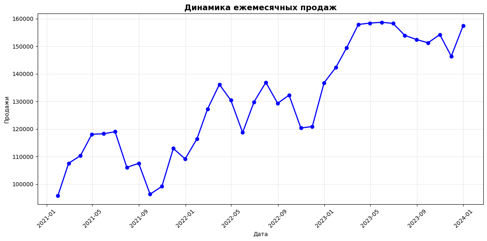
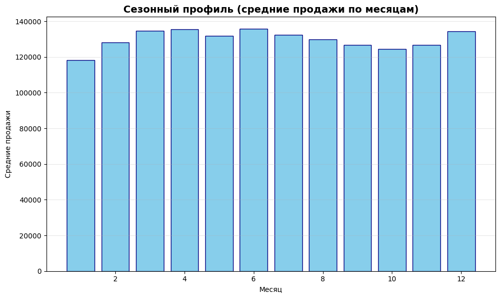
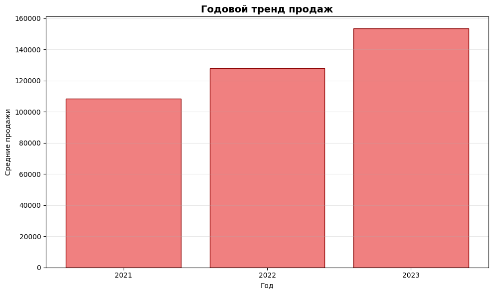
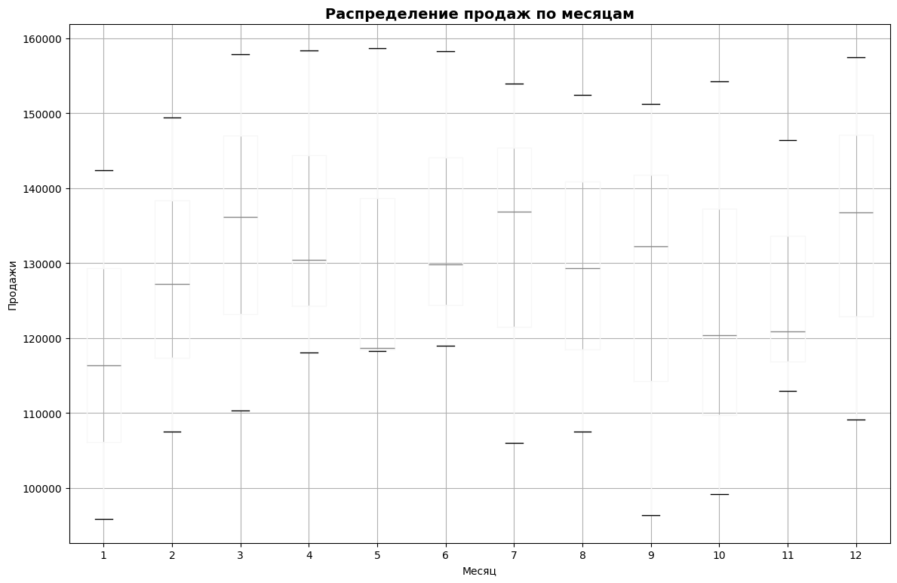
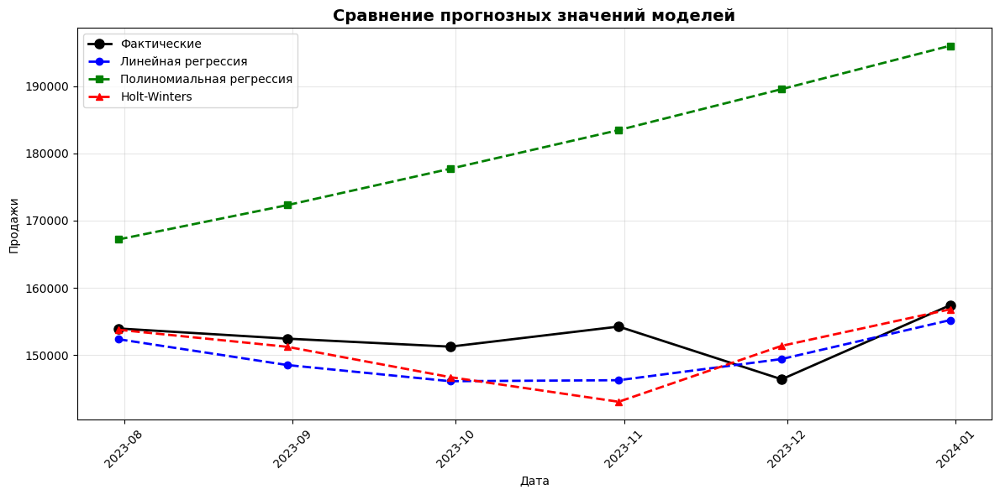
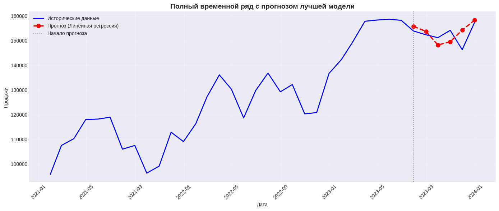
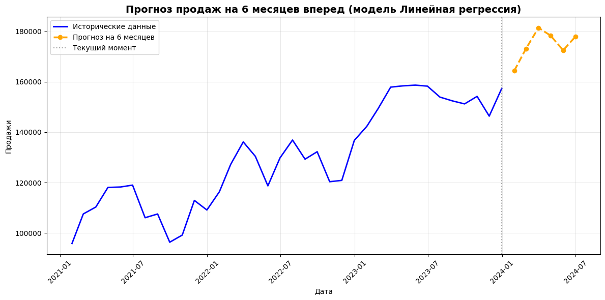
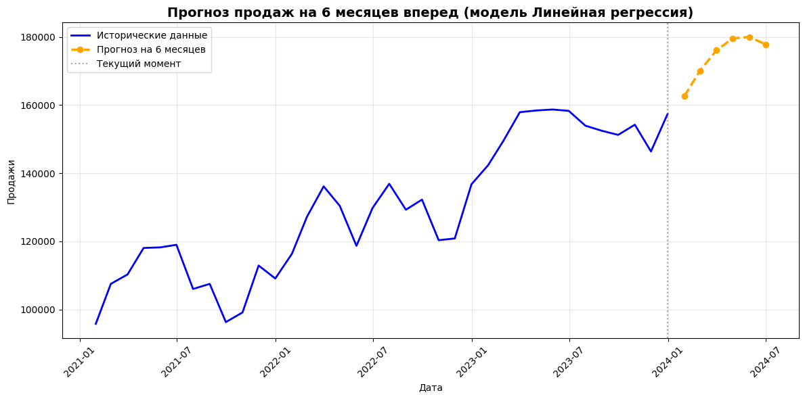

# praktikaMarch
# Прогнозирование продаж на основе временного ряда

## 📊 Описание проекта

Проект представляет собой систему прогнозирования ежемесячных продаж на основе временного ряда данных. Разработан в рамках учебного задания по анализу данных и машинному обучению.

### Цель работы
Разработать и сравнить несколько моделей прогнозирования для предсказания объема продаж на 6 месяцев вперед с оценкой точности каждой модели.

---

## 📁 Структура проекта

---

## 📈 Данные

**Период:** январь 2021 – декабрь 2023  
**Количество записей:** 36  
**Формат:** CSV

| Дата | Продажи |
|------|---------|
| 2021-01-31 | 95,799.45 |
| 2021-02-28 | 107,537.77 |
| ... | ... |
| 2023-12-31 | 157,402.81 |

---

## 🔧 Используемые модели

| № | Модель | Описание |
|---|--------|----------|
| 1 | **Линейная регрессия** | Базовый метод с дополнительными признаками (сезонность, скользящее среднее) |
| 2 | **Полиномиальная регрессия** | Учет нелинейного тренда (степень 2) |
| 3 | **Экспоненциальное сглаживание** | Адаптивная модель, чувствительная к последним изменениям |

### Дополнительные признаки
- `month_sin`, `month_cos` – циклическое кодирование месяца
- `ma_3` – скользящее среднее за 3 месяца
- `quarter` – номер квартала
- `high_season`, `low_season` – индикаторы сезонных пиков и спадов

---

## 📊 Метрики оценки

Для сравнения моделей используются следующие метрики:

- **MAE** (Mean Absolute Error) – средняя абсолютная ошибка
- **MSE** (Mean Squared Error) – среднеквадратичная ошибка
- **RMSE** (Root Mean Squared Error) – корень из MSE
- **MAPE** (Mean Absolute Percentage Error) – средняя абсолютная процентная ошибка

---

## 🚀 Результаты

### Сравнение моделей

| Модель | MAE | RMSE | MAPE |
|--------|-----|------|------|
| Линейная регрессия | 3,056 | 3,146 | **2.03%** |
| Полиномиальная регрессия | 6,602 | 6,761 | 4.45% |
| Экспоненциальное сглаживание | 8,543 | 8,552 | 5.68% |

**🏆 Лучшая модель:** Линейная регрессия (MAPE = 2.03%)

### Прогноз на 6 месяцев

| Дата | Прогноз | Изменение |
|------|---------|-----------|
| 2024-01-31 | 161,440 | +2.56% |
| 2024-02-29 | 162,536 | +0.68% |
| 2024-03-31 | 162,590 | +0.03% |
| 2024-04-30 | 161,354 | -0.76% |
| 2024-05-31 | 159,909 | -0.90% |
| 2024-06-30 | 158,349 | -0.98% |

---

## 📸 Визуализация

### 1. Динамика временного ряда


*График показывает изменение продаж за весь период наблюдения (январь 2021 – декабрь 2023). Наблюдается устойчивый восходящий тренд.*

### 2. Сезонный профиль


*Средние значения продаж по месяцам. Пик продаж приходится на апрель-июнь, спад — на сентябрь-октябрь.*

### 3. Годовой тренд


*Сравнение средних продаж по годам. Рост составил 37% за три года.*

### 4. Распределение продаж по месяцам


*Boxplot-диаграмма, показывающая разброс значений продаж для каждого месяца. Наглядно видна сезонная вариативность.*

### 5. Сравнение прогнозов моделей


*Фактические значения на тестовой выборке (последние 6 месяцев) и прогнозы всех трех моделей. Линейная регрессия наиболее точно повторяет реальные значения.*

### 6. Лучшая модель с прогнозом


*Полный временной ряд и прогноз лучшей модели (линейной регрессии) на тестовой выборке. Вертикальная линия отмечает начало прогнозного периода.*

### 7. Прогноз на будущее


*Прогноз продаж на следующие 6 месяцев (январь-июнь 2024 года) на основе лучшей модели.*

### 8. Прогноз на будущее (дополнительный)


---

## 🛠️ Установка и запуск

### Требования

```bash
pip install pandas numpy matplotlib scikit-learn statsmodels
